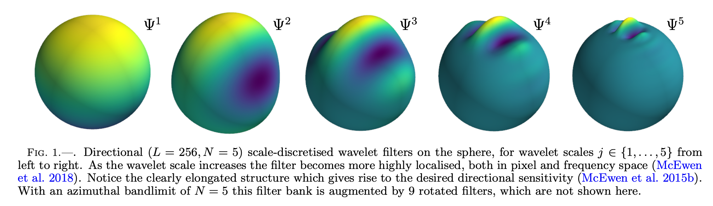

[](https://github.com/astro-informatics/s2wav/actions/workflows/tests.yml)
[](https://codecov.io/gh/astro-informatics/s2wav)
[](https://opensource.org/licenses/MIT)
[](https://arxiv.org/abs/2402.01282) <!-- ALL-CONTRIBUTORS-BADGE:START - Do not remove or modify this section -->
[](#contributors-) <!-- ALL-CONTRIBUTORS-BADGE:END --> 
[](https://github.com/psf/black)
[](https://colab.research.google.com/drive/15E64EAQ7TIp2a3cCoXtnNgf7Ud9MYjVq?usp=sharing)


# Differentiable and accelerated wavelet transform on the sphere

`S2WAV` is a python package for computing wavelet transforms on the sphere
and rotation group, both in JAX and PyTorch. It leverages autodiff to provide differentiable
transforms, which are also deployable on modern hardware accelerators
(e.g. GPUs and TPUs), and can be mapped across multiple accelerators.

More specifically, `S2WAV` provides support for scale-discretised
wavelet transforms on the sphere and rotation group (for both real and
complex signals), with support for adjoints where needed, and comes with
a variety of different optimisations (e.g. precompute or not,
multi-resolution algorithms) that one may select depending on available
resources and desired angular resolution $L$. `S2WAV` is a sister package of 
[`S2FFT`](https://github.com/astro-informatics/s2fft), both of which are part of the `SAX` 
project, which aims to provide comprehensive support for differentiable transforms on the 
sphere and rotation group.

> [!TIP]
> As of version 1.0.0 `S2WAV` also provides partial frontend support for PyTorch. In future 
> this will be expanded to full support. Also note that this release also provides JAX support 
> for existing C spherical harmonic libraries, specifically `SSHT`. This works be wrapping 
> python bindings with custom JAX frontends. Note that currently this C to JAX interoperability 
> is limited to CPU.

## Wavelet Transform :zap: 
`S2WAV` is an updated implementation of the scale-discretised wavelet transform on the 
sphere, which builds upon the papers of [Leistedt et al 2013](https://arxiv.org/abs/1211.1680) 
and [McEwen et al 2017](https://arxiv.org/abs/1509.06749). This wavelet transform is designed to 
have excellent localisation and uncorrelation properties, and has been successfully adopted for 
various applications e.g. scattering transforms on the sphere [McEwen et al 2022](https://arxiv.org/pdf/2102.02828.pdf). 
The wavelet dictionary is constructed by tiling the harmonic line with infinitely differentiable 
Cauchy-Schwartz functions, which can straightforwardly be performed in an efficient multiresolution 
manner, as in the Euclidean case. This is what the directional wavelet filters look like in pixel space.

<p align="center">
  
</p>

## Installation :computer:

The Python dependencies for the `S2WAV` package are listed in the file
`requirements/requirements-core.txt` and will be automatically installed
into the active python environment by [pip](https://pypi.org) when running

``` bash
pip install s2wav     
```
This will install the core functionality which includes JAX support (including PyTorch support).

Alternatively, the `S2WAV` package may be installed directly from GitHub by cloning this 
repository and then running

``` bash
pip install .
```

from the root directory.

Unit tests can then be executed to ensure the installation was successful by first 
installing the test requirements and then running pytest

``` bash
pip install -r requirements/requirements-tests.txt
pytest tests/  
```

Documentation for the released version is available [here](https://astro-informatics.github.io/s2wav/).
To build the documentation locally run 

``` bash
pip install -r requirements/requirements-docs.txt
cd docs 
make html
open _build/html/index.html
```

## Usage :rocket:

To import and use `S2WAV` is as simple follows:

``` python
# Compute wavelet coefficients
f_wav, f_scal = s2wav.analysis(f, L, N)

# Map back to signal on the sphere 
f = s2wav.synthesis(f_wav, f_scal, L, N)
```
> [!NOTE]  
> However we strongly recommend that the multiresolution argument is set to true, as this 
> will accelerate the transform by a factor of the total number of wavelet scales, which 
> can be around an order of magnitude.

## C JAX Frontends for SSHT :bulb:

`S2WAV` also provides JAX support for SSHT, which is a highly optimised C library which 
implements the underlying spherical harmonic transforms. This works by wrapping python 
bindings with custom JAX frontends. Note that this C to JAX interoperability is currently 
limited to CPU.

For example, one may call these alternate backends for the spherical wavelet transform by:

``` python
# Compute wavelet coefficients using SSHT C library backend
f_wav, f_scal = s2wav.analysis(f, L, N, use_c_backend=True)

# Map back to signal on the sphere using SSHT C library backend
f = s2wav.synthesis(f_wav, f_scal, L, N, use_c_backend=True)
```
These JAX frontends supports out of the box reverse mode automatic differentiation, 
and under the hood is simply linking to the C packages you are familiar with. In this 
way S2fft enhances existing packages with gradient functionality for modern scientific 
computing or machine learning applications!

For further details on usage see the associated [notebooks](https://astro-informatics.github.io/s2wav/tutorials/index.html).

## Contributors ✨
We strongly encourage contributions from any interested developers; a
simple example would be adding support for new wavelet filters e.g. spherical needlets 
[Chan et al 2016](https://arxiv.org/abs/1511.05578) or spherical ridgelets 
[McEwen & Price 2020](https://arxiv.org/pdf/1510.01595.pdf)! Thanks goes to these wonderful people ([emoji
key](https://allcontributors.org/docs/en/emoji-key)):

<!-- ALL-CONTRIBUTORS-LIST:START - Do not remove or modify this section -->
<!-- prettier-ignore-start -->
<!-- markdownlint-disable -->
<table>
  <tbody>
    <tr>
      <td align="center" valign="top" width="14.28%"><a href="https://cosmomatt.github.io"><br /><sub><b>Matt Price</b></sub></a><br /><a href="https://github.com/astro-informatics/s2wav/commits?author=CosmoMatt" title="Code">💻</a> <a href="https://github.com/astro-informatics/s2wav/pulls?q=is%3Apr+reviewed-by%3ACosmoMatt" title="Reviewed Pull Requests">👀</a> <a href="https://github.com/astro-informatics/s2wav/commits?author=CosmoMatt" title="Documentation">📖</a> <a href="#design-CosmoMatt" title="Design">🎨</a></td>
      <td align="center" valign="top" width="14.28%"><a href="http://www.jasonmcewen.org"><br /><sub><b>Jason McEwen </b></sub></a><br /><a href="https://github.com/astro-informatics/s2wav/pulls?q=is%3Apr+reviewed-by%3Ajasonmcewen" title="Reviewed Pull Requests">👀</a> <a href="#design-jasonmcewen" title="Design">🎨</a></td>
      <td align="center" valign="top" width="14.28%"><a href="https://alicjaap.github.io/"><br /><sub><b>Alicja Polanska</b></sub></a><br /><a href="https://github.com/astro-informatics/s2wav/commits?author=alicjapolanska" title="Code">💻</a> <a href="https://github.com/astro-informatics/s2wav/pulls?q=is%3Apr+reviewed-by%3Aalicjapolanska" title="Reviewed Pull Requests">👀</a></td>
      <td align="center" valign="top" width="14.28%"><a href="https://github.com/JessWhitney"><br /><sub><b>Jessica Whitney</b></sub></a><br /><a href="https://github.com/astro-informatics/s2wav/commits?author=JessWhitney" title="Code">💻</a> <a href="https://github.com/astro-informatics/s2wav/pulls?q=is%3Apr+reviewed-by%3AJessWhitney" title="Reviewed Pull Requests">👀</a></td>
    </tr>
  </tbody>
</table>

<!-- markdownlint-restore -->
<!-- prettier-ignore-end -->

<!-- ALL-CONTRIBUTORS-LIST:END -->

## Attribution

A BibTeX entry for `S2WAV` is:

``` 
@article{price:s2wav, 
   author = {Matthew A. Price and Alicja Polanska and Jessica Whitney and Jason D. McEwen},
    title = {"Differentiable and accelerated directional wavelet transform on the sphere and ball"},
   eprint = {arXiv:2402.01282},
     year = {2024}
}
```

we also request that you cite the following paper 

``` 
@article{price:s2fft, 
   author      = "Matthew A. Price and Jason D. McEwen",
   title       = "Differentiable and accelerated spherical harmonic and Wigner transforms",
   journal     = "Journal of Computational Physics, submitted",
   year        = "2023",
   eprint      = "arXiv:2311.14670"        
}
```

in which the core underlying algorithms for the spherical harmonic and Wigner transforms 
are developed.

## License :memo:

Copyright 2024 Matthew Price, Jessica Whtiney, Alicja Polanska, Jason
McEwen and contributors.

`S2WAV` is free software made available under the MIT License. For
details see the LICENSE file.
