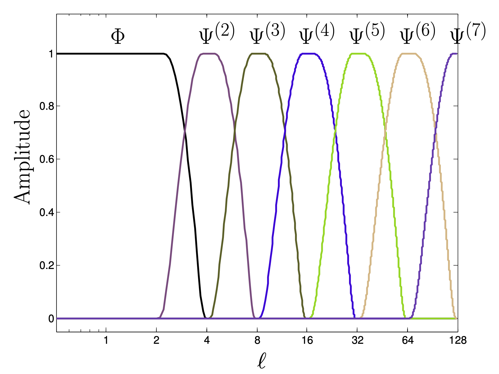

[](https://github.com/astro-informatics/s2wav/actions/workflows/tests.yml)
[](https://codecov.io/gh/astro-informatics/s2wav)
[](https://opensource.org/licenses/MIT)
[](https://arxiv.org/abs/xxxx.xxxxx) <!-- ALL-CONTRIBUTORS-BADGE:START - Do not remove or modify this section -->
[](#contributors-) <!-- ALL-CONTRIBUTORS-BADGE:END --> 
[](https://github.com/psf/black)
[](https://colab.research.google.com/drive/15E64EAQ7TIp2a3cCoXtnNgf7Ud9MYjVq?usp=sharing)


# Differentiable and accelerated spherical wavelets with JAX

`S2WAV` is a JAX package for computing wavelet transforms on the sphere
and rotation group. It leverages autodiff to provide differentiable
transforms, which are also deployable on modern hardware accelerators
(e.g. GPUs and TPUs), and can be mapped across multiple accelerators.

More specifically, `S2WAV` provides support for scale-discretised
wavelet transforms on the sphere and rotation group (for both real and
complex signals), with support for adjoints where needed, and comes with
a variety of different optimisations (e.g. precompute or not,
multi-resolution algorithms) that one may select depending on available
resources and desired angular resolution $L$. `S2WAV` is a sister package of [`S2FFT`](https://github.com/astro-informatics/s2fft), both of which are part of the `SAX` project, which aims to provide comprehensive support for differentiable transforms on the sphere and rotation group.

## Wavelet Transform :zap: 
`S2WAV` is an updated implementation of the scale-discretised wavelet transform on the sphere, which builds upon the papers of [Leistedt et al 2013](https://arxiv.org/abs/1211.1680) and [McEwen et al 2017](https://arxiv.org/abs/1509.06749). This wavelet transform is designed to have excellent localisation and uncorrelation properties, and has been successfully adopted for various applications e.g. scattering transforms on the sphere [McEwen et al 2022](https://arxiv.org/pdf/2102.02828.pdf). The wavelet dictionary is constructed by tiling the harmonic line as follows



which can straightforwardly be performed in an efficient multiresolution manne, as in the Euclidean case. For example the directional wavelet decomposition of a topographic map of the Earth can be seen here


## Installation :computer:

The Python dependencies for the `S2WAV` package are listed in the file
`requirements/requirements-core.txt` and will be automatically installed
into the active python environment by [pip](https://pypi.org) when running

``` bash
pip install .        
```

from the root directory of the repository. Unit tests can then be
executed to ensure the installation was successful by running

``` bash
pytest tests/
```

In the near future one will be able to install `S2WAV` directly from
[PyPi](https://pypi.org) by `pip install s2wav` but this is not yet supported.
Note that to run `JAX` on NVIDIA GPUs you will need to follow the
[guide](https://github.com/google/jax#installation) outlined by Google.

## Usage :rocket:

To import and use `S2WAV` is as simple follows:

``` python
import s2wav 

# Compute wavelet coefficients
f_wav, f_scal = s2wav.analysis(f, L, N)

# Map back to signal on the sphere 
f = s2wav.synthesis(f_wav, f_scal, L, N)
```
however we strongly recommend that the multiresolution argument is set to true, as this will accelerate the transform by a factor of the total number of wavelet scales, which can be around an order of magnitude.

## Contributors ✨
We strongly encourage contributions from any interested developers; a
simple example would be adding support for new wavelet filters e.g. spherical needlets 
[Chan et al 2016](https://arxiv.org/abs/1511.05578) or spherical ridgelets 
[McEwen & Price 2020](https://arxiv.org/pdf/1510.01595.pdf)! Thanks goes to these wonderful people ([emoji
key](https://allcontributors.org/docs/en/emoji-key)):

<!-- ALL-CONTRIBUTORS-LIST:START - Do not remove or modify this section -->
<!-- prettier-ignore-start -->
<!-- markdownlint-disable -->
<table>
  <tbody>
    <tr>
      <td align="center" valign="top" width="14.28%"><a href="https://cosmomatt.github.io"><br /><sub><b>Matt Price</b></sub></a><br /><a href="https://github.com/astro-informatics/s2wav/commits?author=CosmoMatt" title="Code">💻</a> <a href="https://github.com/astro-informatics/s2wav/pulls?q=is%3Apr+reviewed-by%3ACosmoMatt" title="Reviewed Pull Requests">👀</a> <a href="https://github.com/astro-informatics/s2wav/commits?author=CosmoMatt" title="Documentation">📖</a> <a href="#design-CosmoMatt" title="Design">🎨</a></td>
      <td align="center" valign="top" width="14.28%"><a href="http://www.jasonmcewen.org"><br /><sub><b>Jason McEwen </b></sub></a><br /><a href="https://github.com/astro-informatics/s2wav/pulls?q=is%3Apr+reviewed-by%3Ajasonmcewen" title="Reviewed Pull Requests">👀</a> <a href="#design-jasonmcewen" title="Design">🎨</a></td>
      <td align="center" valign="top" width="14.28%"><a href="https://alicjaap.github.io/"><br /><sub><b>Alicja Polanska</b></sub></a><br /><a href="https://github.com/astro-informatics/s2wav/commits?author=alicjapolanska" title="Code">💻</a> <a href="https://github.com/astro-informatics/s2wav/pulls?q=is%3Apr+reviewed-by%3Aalicjapolanska" title="Reviewed Pull Requests">👀</a></td>
      <td align="center" valign="top" width="14.28%"><a href="https://github.com/JessWhitney"><br /><sub><b>Jessica Whitney</b></sub></a><br /><a href="https://github.com/astro-informatics/s2wav/commits?author=JessWhitney" title="Code">💻</a> <a href="https://github.com/astro-informatics/s2wav/pulls?q=is%3Apr+reviewed-by%3AJessWhitney" title="Reviewed Pull Requests">👀</a></td>
    </tr>
  </tbody>
</table>

<!-- markdownlint-restore -->
<!-- prettier-ignore-end -->

<!-- ALL-CONTRIBUTORS-LIST:END -->

## Attribution

A BibTeX entry for `S2WAV` is:

``` 
@article{price:s2wav, 
   AUTHOR = {Author names},
    TITLE = {"TBA"},
   EPRINT = {arXiv:0000.00000},
     YEAR = {2023}
}
```

## License :memo:

Copyright 2023 Matthew Price, Jessica Whtiney, Alicja Polanska, Jason
McEwen and contributors.

`S2WAV` is free software made available under the MIT License. For
details see the LICENSE file.
