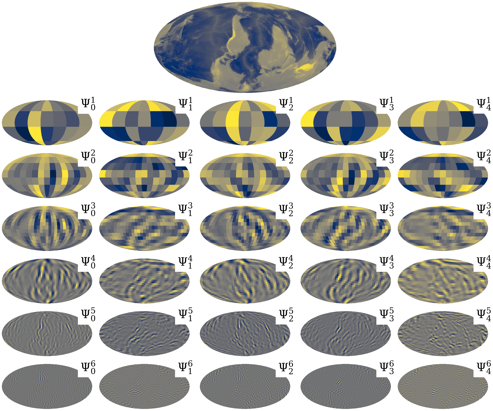

Differentiable and accelerated spherical wavelets
===================================================

``S2WAV`` is a JAX package for computing wavelet transforms on the sphere and rotation 
group.  It leverages autodiff to provide differentiable transforms, which are also 
deployable on modern hardware accelerators (e.g. GPUs and TPUs), and can be mapped 
across multiple accelerators.

More specifically, ``S2WAV`` provides support for scale-discretised wavelet transforms 
on the sphere and rotation group (for both real and complex signals), with support for 
adjoints where needed, and comes with a variety of different optimisations (e.g. precompute 
or not, multi-resolution algorithms) that one may select depending on available resources 
and desired angular resolution :math:`L`.

Wavelet Transform |:zap:|
--------------------------
``S2WAV`` is an updated implementation of the scale-discretised wavelet transform on the 
sphere, which builds upon the papers of 
`Leistedt et al 2013 <https://arxiv.org/abs/1211.1680>`_ and `McEwen et al 2017 <https://arxiv.org/abs/1509.06749>`_. 
This wavelet transform is designed to have excellent localisation and uncorrelation 
properties, and has been successfully adopted for various applications e.g. 
scattering transforms on the sphere `McEwen et al 2022 <https://arxiv.org/pdf/2102.02828.pdf>`_. 
The wavelet dictionary is constructed by tiling the harmonic line with infinitely 
differentiable Cauchy-Schwartz functions, which can straightforwardly be performed 
in an efficient multiresolution manner, as in the Euclidean case. For example the 
directional wavelet decomposition of a topographic map of the Earth can be seen 
below

Contributors ✨
---------------
We strongly encourage contributions from any interested developers; a
simple example would be adding support for new wavelet filters e.g. spherical needlets 
`Chan et al 2016 <https://arxiv.org/abs/1511.05578>`_ or spherical ridgelets 
`McEwen & Price 2020 <https://arxiv.org/pdf/1510.01595.pdf>`_! Thanks goes to these 
wonderful people (`emojikey <https://allcontributors.org/docs/en/emoji-key>`_):

.. raw:: html

   <embed>
      <table>
         <tbody>
            <tr>
               <td align="center" valign="top" width="14.28%"><a href="https://cosmomatt.github.io"> <b>Matt Price</b></a> <a href="https://github.com/astro-informatics/s2wav/commits?author=CosmoMatt" title="Code">💻</a> <a href="https://github.com/astro-informatics/s2wav/pulls?q=is%3Apr+reviewed-by%3ACosmoMatt" title="Reviewed Pull Requests">👀</a> <a href="https://github.com/astro-informatics/s2wav/commits?author=CosmoMatt" title="Documentation">📖</a> <a href="#design-CosmoMatt" title="Design">🎨</a></td>
               <td align="center" valign="top" width="14.28%"><a href="http://www.jasonmcewen.org"> <b>Jason McEwen </b></a> <a href="https://github.com/astro-informatics/s2wav/pulls?q=is%3Apr+reviewed-by%3Ajasonmcewen" title="Reviewed Pull Requests">👀</a> <a href="#design-jasonmcewen" title="Design">🎨</a></td>
               <td align="center" valign="top" width="14.28%"><a href="https://alicjaap.github.io/"> <b>Alicja Polanska</b></a> <a href="https://github.com/astro-informatics/s2wav/commits?author=alicjapolanska" title="Code">💻</a> <a href="https://github.com/astro-informatics/s2wav/pulls?q=is%3Apr+reviewed-by%3Aalicjapolanska" title="Reviewed Pull Requests">👀</a></td>
               <td align="center" valign="top" width="14.28%"><a href="https://github.com/JessWhitney"> <b>Jessica Whitney</b></a> <a href="https://github.com/astro-informatics/s2wav/commits?author=JessWhitney" title="Code">💻</a> <a href="https://github.com/astro-informatics/s2wav/pulls?q=is%3Apr+reviewed-by%3AJessWhitney" title="Reviewed Pull Requests">👀</a></td>
            </tr>
         </tbody>
      </table>
   </embed>

Attribution |:books:|
----------------------
A BibTeX entry for ``S2WAV`` is:

.. code-block:: 

    @article{price:s2wav, 
        author      = "Matthew A. Price and Alicja Polanska and Jessica Whitney and Jason D. McEwen",
        title       = "Differentiable and accelerated directional wavelet transform on the sphere and ball",
        year        = "2024",
        eprint      = "arXiv:2402.01282"        
    }

License |:memo:|
-----------------

Copyright 2023 Matthew Price, Jessica Whtiney, Alicja Polanska, Jason McEwen and contributors.

``S2WAV`` is free software made available under the MIT License. For details see
the LICENSE file.

.. bibliography:: 
    :notcited:
    :list: bullet

.. * :ref:`modindex`

.. toctree::
   :hidden:
   :maxdepth: 2
   :caption: User Guide

   user_guide/install

.. toctree::
   :hidden:
   :maxdepth: 3
   :caption: Interactive Tutorials
   
   tutorials/index

.. toctree::
   :hidden:
   :maxdepth: 3
   :caption: API

   api/index

